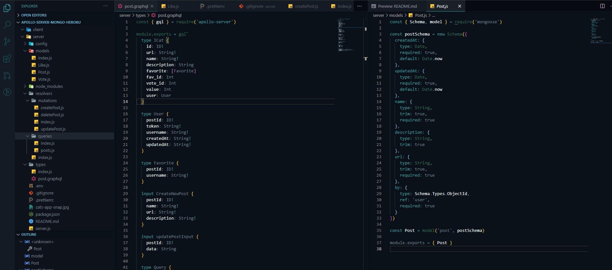

# APOLLO GRAPHQL MONGODB SERVER.

## apollo-graphql-mongodb-server

On my previous project the react app was consuming a rest api from TheCatAPI. TheCatAPI built with in mind multiple api end point for many purposes probably not meant to be consumed by frontend app or maybe its outdated. I was under fetching all the time it requires lots of follow up api calls. So I thought I would design my own back end api with Apollo graphql and express server to handle all extra activities and store app info on mangoDB while the TheCatApi handle image processing and recognition

> In this project: , Apollo-server, graphql, express, mongoDB, node...

> no external plugin has been used

> Demo link https://dev.d3p0wtsxt3xr73.amplifyapp.com/

## Installation

```sh
git clone ...
npm install then npm start
#or
yarn install then yarn start
```

## Back-end-server



## Front-end-app


```sh

2021 new years eve project
Happy new Year, Merry Christmas and Happy Holidays
Darik.

```
